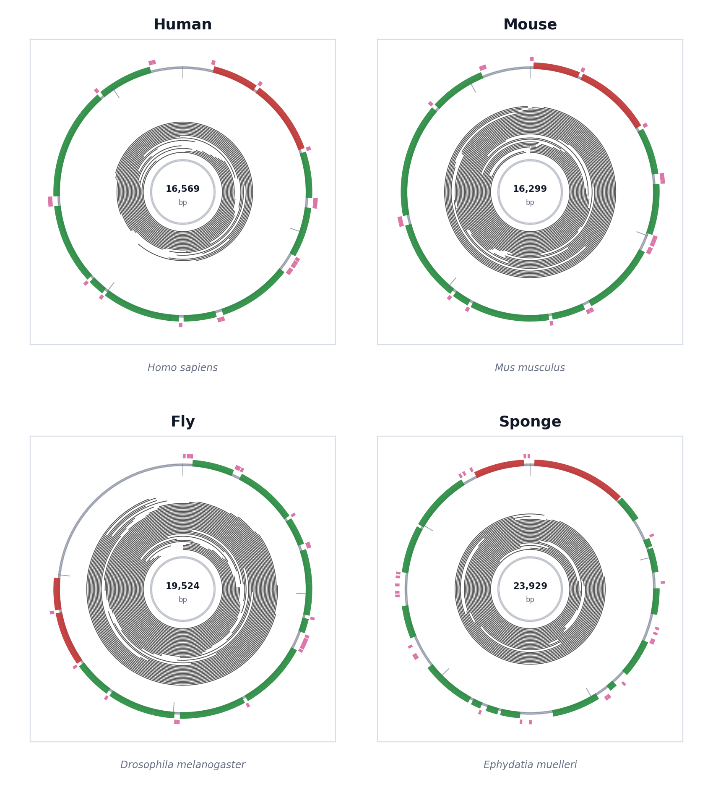

# redwood

`redwood` is a standalone circular genome plotting tool extracted from the
`pauvre redwood` plotter. It draws circular plots with optional long-read BAM
rings, GFF annotation tracks, and RNA-seq depth tracks.

<picture>
  <source media="(prefers-color-scheme: dark)" srcset="docs/assets/redwood-grid-dark.png">
  <source media="(prefers-color-scheme: light)" srcset="docs/assets/redwood-grid-light.png">
  
</picture>

## Install

```bash
pip install .
```

For development:

```bash
pip install -e ".[dev]"
```

## Usage

Plot annotation only:

```bash
redwood plot --gff tests/testdata/gff_files/Bf201706.gff \
  --no-timestamp -o Bf201706
```

Plot long reads, annotation, and RNA-seq depth:

```bash
redwood plot \
  --main-bam reads.bam \
  --rnaseq-bam rnaseq.bam \
  --gff annotation.gff \
  --doubled main \
  --query "ALNLEN >= 10000" "MAPLEN < reflength" \
  -o sample_redwood
```

Input BAM files must be indexed with `samtools index`.

## Local Workflow

`redwood` also includes workflow subcommands for building the BAMs and metrics
used by a complete circular genome plot. These commands use local files and
expect `minimap2` and `samtools` on `PATH` for mapping jobs.

Prepare derived references:

```bash
redwood prepare-reference \
  --mito-fasta mitochondrion.fa \
  --nuclear-fasta nuclear.fa \
  --outdir redwood-work
```

Map long reads to a doubled mitochondrial reference and select reads that span
large fractions of the circular genome:

```bash
redwood map-long \
  --mito-fasta mitochondrion.fa \
  --long-reads ont.fastq.gz \
  --outdir redwood-work \
  --target-depth 50 \
  --min-span-fraction 0.25
```

Map RNA-seq reads against a nuclear bait reference plus the mitochondrial
sequence, then keep primary mitochondrial alignments:

```bash
redwood map-rnaseq \
  --mito-fasta mitochondrion.fa \
  --nuclear-fasta nuclear.fa \
  --rnaseq-reads rna_1.fastq.gz rna_2.fastq.gz \
  --outdir redwood-work
```

Run the full local workflow:

```bash
redwood run \
  --mito-fasta mitochondrion.fa \
  --nuclear-fasta nuclear.fa \
  --gff annotation.gff \
  --long-reads ont.fastq.gz \
  --rnaseq-reads rna_1.fastq.gz rna_2.fastq.gz \
  --outdir redwood-work
```

The workflow writes selected long-read BAMs, mitochondrial RNA-seq BAMs,
`redwood.metrics.json`, `redwood.workflow.json`, and a plot output base under
the requested output directory.

The plotting CLI also accepts `--extra-track` declarations for newer plot
styles, including `at`, `gc`, `rnaseq-strand`, and `metrics`. The legacy plotter
currently renders the default read, annotation, and RNA-seq depth tracks.

## Notes

This repository keeps the original redwood plotting lineage from
[`pauvre`](https://github.com/conchoecia/pauvre), focused into a dedicated
package and command-line interface for circular genome plots.
