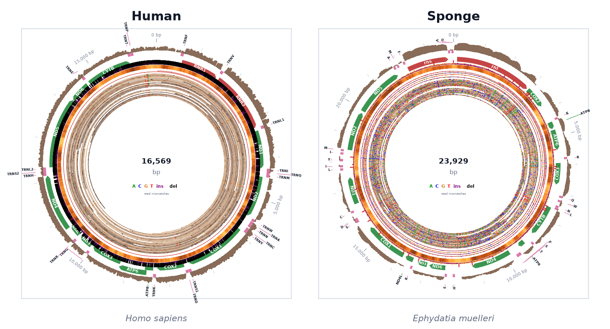
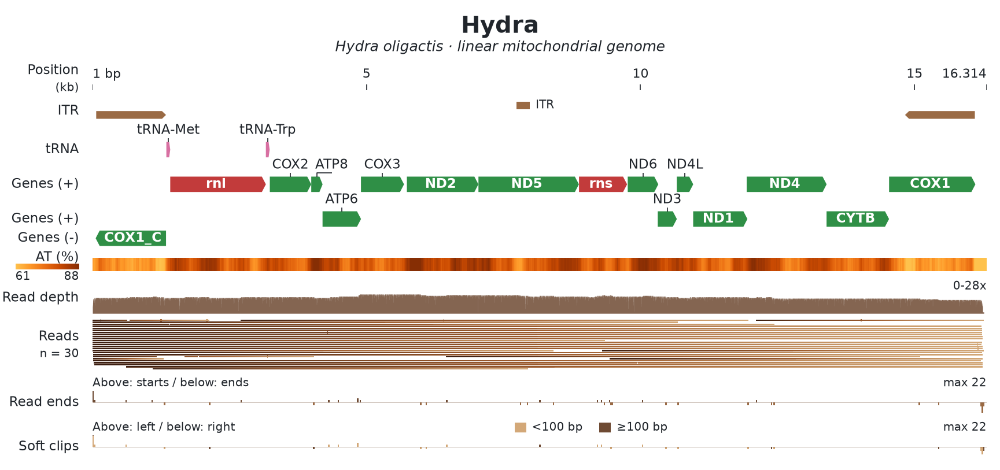

# redwood

Redwood draws circular and linear genome maps with gene annotations, long-read
alignments, sequence composition, and coverage tracks. It is a standalone
plotting tool descended from `pauvre redwood`.

## Examples

These examples use real sequencing reads and can be reproduced from the bundled
[example datasets](examples/datasets/README.md). Run the commands from a checkout
after [installing Redwood](#install).

### Circular genomes

<picture>
  <source media="(prefers-color-scheme: dark)" srcset="docs/assets/redwood-circular-dark.png">
  <source media="(prefers-color-scheme: light)" srcset="docs/assets/redwood-circular-light.png">
  
</picture>

Human and sponge mitogenomes, with Redwood's wood-gradient reads, green protein
genes, red rRNAs, pink tRNAs, warm AT-composition ring, and brown RNA-depth track.
Reproduce the human example:

```bash
redwood plot --topology circular \
  --mito-fasta examples/datasets/human/reference.fa \
  --gff examples/datasets/human/annotation.gff \
  --main-bam examples/datasets/human/reads.mapped.bam \
  --rnaseq-bam examples/datasets/human/rnaseq.mapped.bam \
  --doubled main --max-reads 80 \
  --fileform pdf svg png --no-timestamp -T -o human_redwood
```

### Linear mitochondrial genomes

<picture>
  <source media="(prefers-color-scheme: dark)" srcset="docs/assets/redwood-linear-dark.png">
  <source media="(prefers-color-scheme: light)" srcset="docs/assets/redwood-linear-light.png">
  
</picture>

*Hydra oligactis*, using the public reference
[NC_010214.1](https://www.ncbi.nlm.nih.gov/nuccore/NC_010214.1) and real ONT reads
from [SRR18362010](https://www.ncbi.nlm.nih.gov/sra/SRR18362010).
The same colors and tracks are arranged along a shared linear coordinate axis.
The displayed reads are balanced across the two ends, then ordered by mapping
position. Depth and diagnostic tracks use the complete bundled read subset.
The ITR arrows mark exact inverted-repeat cores identified in the reference;
see the [dataset provenance](examples/datasets/README.md#linear-hydra-example).

```bash
redwood plot --topology linear \
  --mito-fasta examples/datasets/hydra/reference.fa \
  --gff examples/datasets/hydra/annotation.gff \
  --main-bam examples/datasets/hydra/reads.mapped.bam \
  --linear-layout two-column --max-reads 30 --terminal-window 100 \
  --linear-track depth --linear-track ends --linear-track clips \
  --fileform pdf svg png --no-timestamp -T -o hydra_redwood
```

Linear plots use an undoubled reference and BAM. Choose
`--linear-layout one-column` or `--linear-layout two-column` for publication-size
layouts with readable gene and tRNA labels. PDF and SVG support figure assembly;
SVG keeps editable text and individual read outlines. PNG provides a quick
preview. Add `--dark` to either plotting command for the dark theme.

Optional tracks include RNA depth and supplied terminal cap annotations.
`--terminal-details` adds enlarged end panels, and `--variant-sites sites.tsv`
adds an allele panel for specified positions. The main linear figure also exports
a caption draft, layout metadata, and JSON/TSV evidence. See
[linear genome figures](docs/linear-genomes.md) for track definitions,
read-selection options, and publication sizing.

## Install

From a checkout:

```bash
pip install .
```

For development:

```bash
pip install -e ".[dev]"
```

Input BAM files must be indexed with `samtools index`; the bundled examples
already include their indexes. To plot annotation alone, omit the BAM arguments:

```bash
redwood plot --gff tests/testdata/gff_files/Bf201706.gff \
  --no-timestamp -o Bf201706
```

## End-to-End Workflow

`redwood run` builds the intermediate references and BAM files needed for a
circular or linear genome plot. Provide a mitochondrial genome, optional GFF3
annotation, long reads, and optional RNA-seq reads. If RNA-seq reads are supplied,
also provide a nuclear genome FASTA; mitochondrial-looking nuclear FASTA contigs are
excluded before the mitochondrial FASTA is appended as the target.

```bash
redwood run --topology linear \
  --mito-fasta mitochondrion.fa \
  --nuclear-fasta nuclear.fa \
  --gff annotation.gff \
  --long-reads ont.fastq.gz \
  --rnaseq-reads rna_1.fastq.gz rna_2.fastq.gz \
  --long-read-depth 100 \
  --max-reads 80 \
  --outdir redwood-work
```

Use `--topology circular` for a circular genome (the default). Circular mode
maps long reads to a doubled mitochondrial reference and selects reads spanning
large fractions of the genome. Linear mode uses a single reference with
independent ends and balances the displayed long reads across those ends.
Both modes map RNA-seq reads against a nuclear bait reference plus the
mitochondrial genome and keep primary mitochondrial RNA-seq alignments.

The workflow writes `redwood.metrics.json`, `redwood.workflow.json`, and plot
outputs under the requested directory. It expects `minimap2` and `samtools` on
`PATH`.

For existing BAM files, use `redwood plot` directly. To summarize existing BAMs
without plotting, use `redwood metrics`.

ONT mapping (`map-ont`) automatically extracts target-mapped molecules, trims
end adapters with Cutadapt, and remaps them before selection and plotting.
Install `pip install -e '.[ont]'` in a checkout to enable this step.
Use `--no-ont-trim` to skip this step. For an existing ONT BAM, add
`--reprocess-ont` to `redwood plot`, or use `redwood advanced reprocess-ont`.
The bundled Hydra BAM has already been adapter-trimmed and remapped.
Original reads, removed tails, trimming reports and remapped BAMs are retained
when running preprocessing.
See [ONT preprocessing](docs/ont-preprocessing.md) for parameters and provenance.

Lower-level workflow steps are available under `redwood advanced` for debugging
or custom pipelines:

```bash
redwood advanced prepare-reference --help
redwood advanced map-long --help
redwood advanced map-rnaseq --help
redwood advanced reprocess-ont --help
```

## More circular examples

<picture>
  <source media="(prefers-color-scheme: dark)" srcset="docs/assets/redwood-grid-dark.png">
  <source media="(prefers-color-scheme: light)" srcset="docs/assets/redwood-grid-light.png">
  
</picture>

All README figures use the same rendering backends as the plotting CLI. Rebuild
the light and dark previews from the committed datasets without downloading reads:

```bash
python scripts/build_readme_figure.py
```

## Notes

This repository keeps the original redwood plotting lineage from
[`pauvre`](https://github.com/conchoecia/pauvre), focused into a dedicated
package and command-line interface for circular and linear genome plots.
