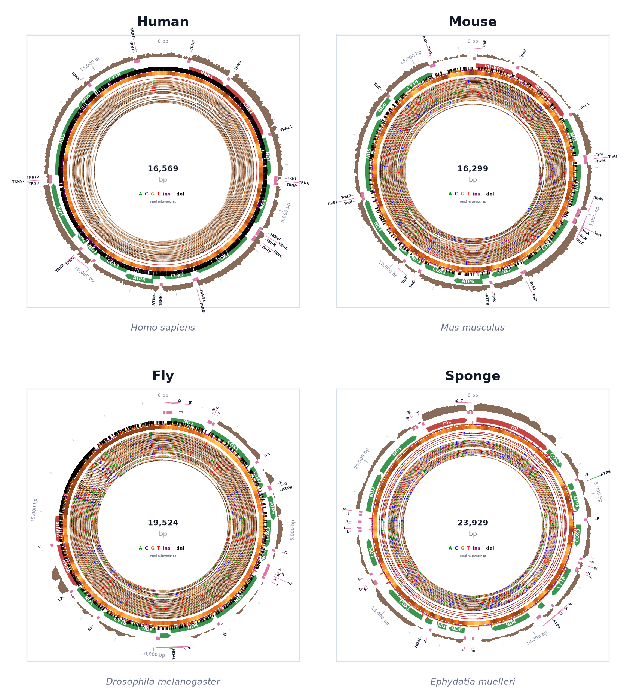

# redwood

`redwood` is a standalone genome plotting tool extracted from the
`pauvre redwood` plotter. It draws circular or linear plots with optional long-read
BAM tracks, GFF annotation tracks, and RNA-seq depth tracks.

<picture>
  <source media="(prefers-color-scheme: dark)" srcset="docs/assets/redwood-grid-dark.png">
  <source media="(prefers-color-scheme: light)" srcset="docs/assets/redwood-grid-light.png">
  
</picture>

## Install

```bash
pip install .
```

For development:

```bash
pip install -e ".[dev]"
```

## Usage

Plot annotation only:

```bash
redwood plot --gff tests/testdata/gff_files/Bf201706.gff \
  --no-timestamp -o Bf201706
```

Plot long reads, annotation, and RNA-seq depth:

```bash
redwood plot \
  --mito-fasta mitochondrion.fa \
  --main-bam reads.bam \
  --rnaseq-bam rnaseq.bam \
  --gff annotation.gff \
  --doubled main \
  --max-reads 80 \
  --query "ALNLEN >= 10000" "MAPLEN < reflength" \
  -o sample_redwood
```

Input BAM files must be indexed with `samtools index`.

For a **linear** mitogenome, use an undoubled BAM and `--topology linear`:

```bash
redwood plot --topology linear --mito-fasta mitochondrion.fa \
  --main-bam reads.bam --gff annotation.gff3 --read-classes reads.tsv \
  --fileform pdf svg png --no-timestamp -T -o linear_mitogenome
```

The production view unrolls Redwood's wood-gradient reads, green/red/pink
annotations, warm AT-composition strip, and optional RNA depth. Linear additions
include long-read depth and terminal repeat/cap annotations. Add
`--linear-track depth --linear-track ends --linear-track clips` for compact
diagnostic bands in the same style, or `--linear-style diagnostic` for separate
diagnostic panels. Both styles export JSON/TSV evidence.
See [linear genome figures](docs/linear-genomes.md) for annotation-only figures,
query filters, evidence definitions, and `redwood run --topology linear`.

The README example figure is built with the same plotting backend used by
`redwood plot` and `redwood run`.

## End-to-End Workflow

`redwood run` builds the intermediate references and BAM files needed for a
complete circular genome plot. Provide a mitochondrial genome, optional GFF3
annotation, long reads, and RNA-seq reads. If RNA-seq reads are supplied, also
provide a nuclear genome FASTA; mitochondrial-looking nuclear FASTA contigs are
excluded before the mitochondrial FASTA is appended as the target.

```bash
redwood run \
  --mito-fasta mitochondrion.fa \
  --nuclear-fasta nuclear.fa \
  --gff annotation.gff \
  --long-reads ont.fastq.gz \
  --rnaseq-reads rna_1.fastq.gz rna_2.fastq.gz \
  --long-read-depth 100 \
  --max-reads 80 \
  --outdir redwood-work
```

The workflow maps long reads to a doubled mitochondrial reference, selects reads
that span large fractions of the circular genome, maps RNA-seq reads against a
nuclear bait reference plus the mitochondrial genome, keeps primary
mitochondrial RNA-seq alignments, and writes `redwood.metrics.json`,
`redwood.workflow.json`, and a plot output base under the requested output
directory. It expects `minimap2` and `samtools` on `PATH`.

For existing BAM files, use `redwood plot` directly. To summarize existing BAMs
without plotting, use `redwood metrics`.

ONT mapping (`map-ont`) automatically extracts target-mapped molecules, trims
end adapters with Cutadapt, and remaps them before selection and plotting.
Install `pip install 'redwood[ont]'` (or `pip install -e '.[ont]'` in a checkout).
Use `--no-ont-trim` to skip this step. For an existing ONT BAM, add
`--reprocess-ont` to `redwood plot`, or use `redwood advanced reprocess-ont`.
Original reads, removed tails, trimming reports and remapped BAMs are retained.
See [ONT preprocessing](docs/ont-preprocessing.md) for parameters and provenance.

Lower-level workflow steps are available under `redwood advanced` for debugging
or custom pipelines:

```bash
redwood advanced prepare-reference --help
redwood advanced map-long --help
redwood advanced map-rnaseq --help
redwood advanced reprocess-ont --help
```

The plotting CLI also accepts `--extra-track` declarations for newer plot
styles, including `at`, `gc`, `rnaseq-strand`, and `metrics`. The legacy plotter
currently renders the default read, annotation, and RNA-seq depth tracks.

## Notes

This repository keeps the original redwood plotting lineage from
[`pauvre`](https://github.com/conchoecia/pauvre), focused into a dedicated
package and command-line interface for circular genome plots.
